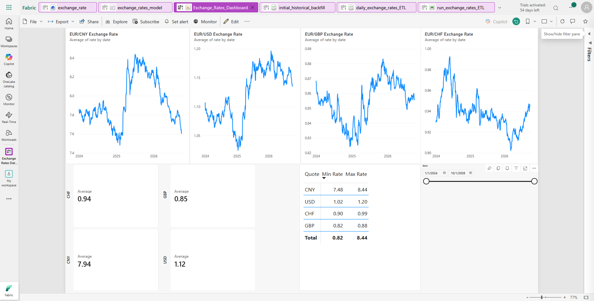
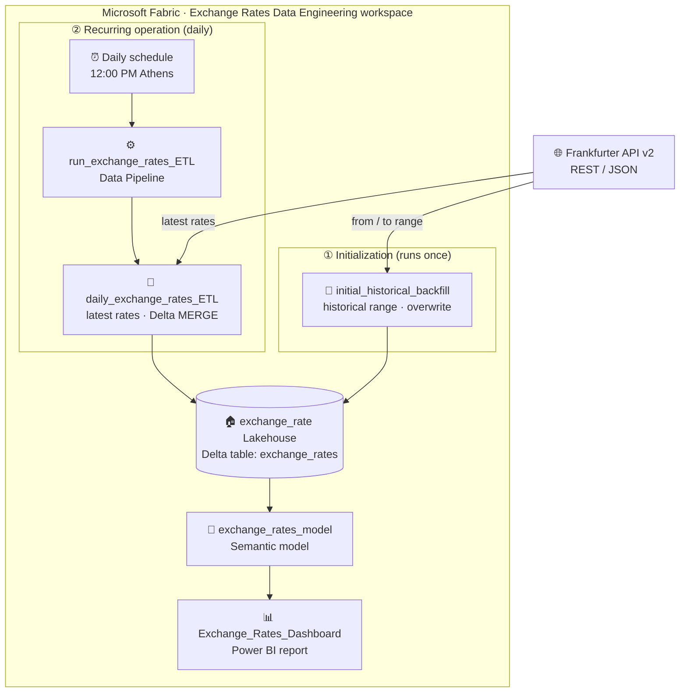
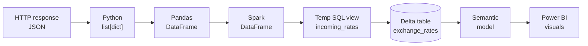
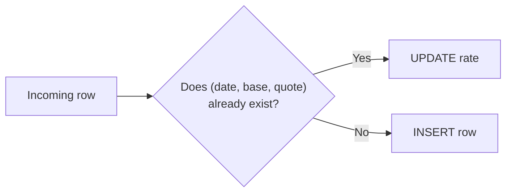
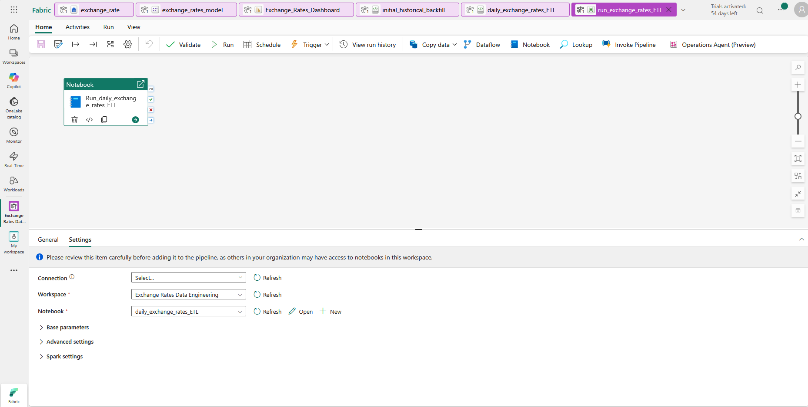
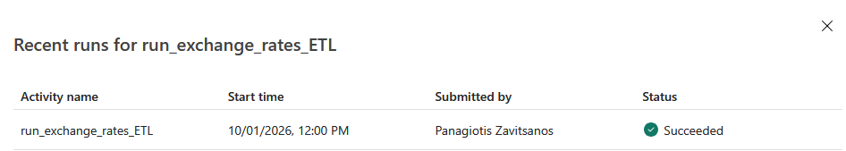
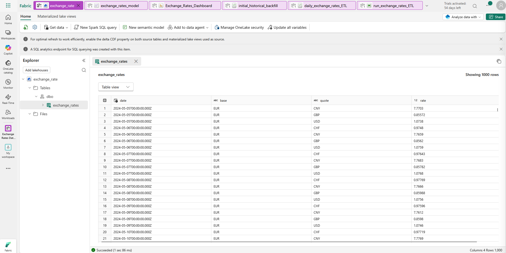
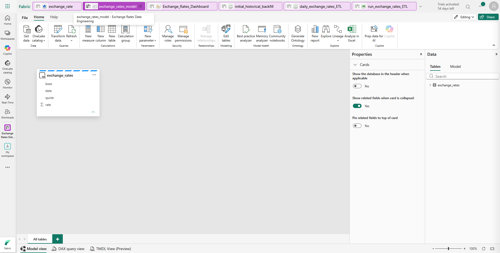
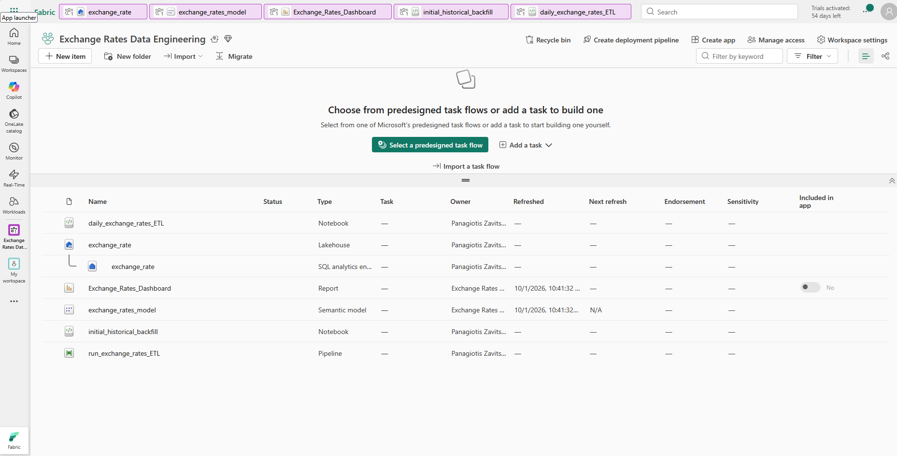

<div align="center">

# 💱 End-to-End Exchange Rate Data Pipeline with Microsoft Fabric

**A hands-on Microsoft Fabric data-engineering project that applies foundational cloud data concepts in a working pipeline: REST API → validation → Delta Lakehouse → incremental MERGE → scheduled pipeline → Power BI.**




*The final output of the pipeline: an interactive Power BI report built on the Fabric Lakehouse.*

</div>

---

## 📑 Contents

1. [Project Overview](#overview)
2. [Architecture](#architecture)
3. [Technology Stack](#tech-stack)
4. [Data Source](#data-source)
5. [Data Model](#data-model)
6. [Historical Backfill](#historical-backfill)
7. [Daily Incremental ETL](#daily-etl)
8. [Data Validation](#data-validation)
9. [Delta MERGE Strategy](#merge-strategy)
10. [Fabric Pipeline & Orchestration](#orchestration)
11. [Lakehouse Storage](#lakehouse)
12. [Semantic Model](#semantic-model)
13. [Power BI Dashboard](#dashboard)
14. [Repository Structure](#repo-structure)
15. [How the Pipeline Works](#how-it-works)
16. [Challenges & Lessons Learned](#lessons-learned)
17. [Possible Future Improvements](#future-improvements)

---

<a id="overview"></a>

## 📌 1. Project Overview

This project implements an end-to-end **batch** data pipeline for historical and daily foreign-exchange rates using **Microsoft Fabric**.

- Exchange-rate data is **extracted** from the Frankfurter REST API.
- It is **transformed and validated** with Python and Pandas, then converted to Spark DataFrames.
- It is **persisted** as a Delta table in a Fabric Lakehouse.
- A **one-time notebook** performs the historical backfill.
- A separate **incremental ETL notebook** uses Delta `MERGE` to update or insert daily observations, based on the `(date, base, quote)` business key.
- A **scheduled Fabric Data Pipeline** orchestrates the daily notebook.
- The data is exposed through a **semantic model** and analyzed in an **interactive Power BI report** with currency trends, average rates, minimum and maximum rates, and date filtering.

| Base | Quote currencies | Pairs tracked |
|:----:|------------------|---------------|
| 🇪🇺 EUR | 🇺🇸 USD · 🇬🇧 GBP · 🇨🇭 CHF · 🇨🇳 CNY | EUR/USD · EUR/GBP · EUR/CHF · EUR/CNY |

> **Background.** The project started as a simple Python ETL exercise that loaded Frankfurter data into a local PostgreSQL database. It was then redesigned as a Microsoft Fabric pipeline, partly as a practical companion to **Microsoft Azure Data Fundamentals (DP-900)** study. The Fabric implementation is the canonical version of the project.

### 🐘 Where it started: the PostgreSQL prototype

📄 [`prototype/postgres_etl_prototype.py`](prototype/postgres_etl_prototype.py)

The original pipeline was a single Python script that ran locally. It already had the same **Extract → Transform → Validate → Load** structure that the Fabric notebooks use today:

- **Extract:** called the Frankfurter API (v1 `latest` endpoint) for EUR → USD, GBP and CHF.
- **Transform:** reshaped the JSON `rates` dictionary into a Pandas DataFrame with `currency, rate, date, base_currency, amount`.
- **Validate:** stopped the run if there were missing values or non-positive rates.
- **Load:** wrote each row into a PostgreSQL `exchange_rates` table with `psycopg`, using `INSERT … ON CONFLICT (date, base_currency, currency) DO UPDATE`. That upsert is the idea that later became the Delta `MERGE`.

| | PostgreSQL prototype | Microsoft Fabric version |
|---|---|---|
| Runs on | Local machine, run by hand | Fabric notebooks + scheduled Data Pipeline |
| API | Frankfurter v1 (`/latest`) | Frankfurter v2 (`/v2/rates`) |
| Currencies | USD, GBP, CHF | USD, GBP, CHF, CNY |
| Storage | PostgreSQL table | Delta table in a Fabric Lakehouse |
| Upsert | `INSERT … ON CONFLICT DO UPDATE` | Delta `MERGE` |
| History | Daily rates only | One-time historical backfill + daily ETL |
| Reporting | SQL queries | Semantic model + Power BI report |

> The prototype is kept for reference only. It needs a local PostgreSQL database and reads the password from the `PGPASSWORD` environment variable.

---

<a id="architecture"></a>

## 🏗️ 2. Architecture

The project has **two ingestion paths** that write to the same Delta table. The backfill **establishes** the historical state once, and the daily ETL **maintains** it incrementally.



### Separation of responsibilities

| Component | Role |
|-----------|------|
| Frankfurter API | **Source** |
| Notebooks | **Processing logic**: *how* the data is processed |
| Spark | **Compute** |
| Lakehouse / Delta table | **Persistent storage** |
| Data Pipeline | **Orchestration**: *when* the processing runs |
| Semantic model | **Analytical / business layer** |
| Power BI | **Presentation and consumption** |

### How the data changes shape

The data moves through several representations on its way from the API to the report:



| Representation | Used for |
|----------------|----------|
| JSON / `list[dict]` | Raw API response after `response.json()` |
| Pandas DataFrame | Simple transformation, datetime conversion, validation and inspection |
| Spark DataFrame | Integration with Spark SQL, Delta Lake and the Fabric Lakehouse |
| Temporary view `incoming_rates` | A temporary, SQL-queryable view of the current batch. It is **not** a persistent table. |
| Delta table `exchange_rates` | Persistent storage in the Lakehouse |
| Semantic model | Fields, aggregations and filter context for BI |

---

<a id="tech-stack"></a>

## 🧰 3. Technology Stack

| Area | Technologies |
|------|--------------|
| Platform | Microsoft Fabric: Notebooks, Lakehouse, Data Pipelines, SQL analytics endpoint |
| Ingestion | Python, `requests`, REST API / JSON |
| Transformation & validation | Pandas |
| Compute | Apache Spark / PySpark, Spark SQL |
| Storage | Delta Lake (Fabric Lakehouse) |
| Analytics | Fabric Semantic Model, SQL, Power BI |
| Version control | Git / GitHub |

---

<a id="data-source"></a>

## 🌐 4. Data Source

The data comes from the **[Frankfurter API v2](https://frankfurter.dev)**, which needs no API key.

```
GET https://api.frankfurter.dev/v2/rates
```

| Parameter | Value |
|-----------|-------|
| `base` | `EUR` |
| `quotes` | `USD,GBP,CHF,CNY` |
| `from` / `to` | Used **only** by the historical backfill |

Each record already maps naturally onto a table row:

```json
{ "date": "2024-01-01", "base": "EUR", "quote": "USD", "rate": 1.1068 }
```

---

<a id="data-model"></a>

## 🗂️ 5. Data Model

The canonical table is deliberately simple: **`exchange_rates`**.

| Column | Spark type | Meaning |
|--------|-----------|---------|
| `date` | `timestamp` | Date of the published exchange rate |
| `base` | `string` | Base currency (currently `EUR`) |
| `quote` | `string` | Quote currency: `USD`, `GBP`, `CHF` or `CNY` |
| `rate` | `double` | Exchange rate (units of quote currency per 1 unit of base) |

**Business key:** `(date, base, quote)`. Each date, base and quote combination has exactly one rate. This composite key drives both **duplicate validation** and **MERGE matching**.

<details>
<summary><b>Why this schema?</b></summary>

<br/>

The earlier PostgreSQL prototype used `currency, rate, date, base_currency, amount`. When the project moved to Frankfurter API v2 and Fabric, the schema was simplified to `date, base, quote, rate`. This matches the v2 records directly and drops fields the analysis doesn't need.

</details>

---

<a id="historical-backfill"></a>

## 🕰️ 6. Historical Backfill

📓 [`notebooks/initial_historical_backfill.ipynb`](notebooks/initial_historical_backfill.ipynb)

**Purpose:** a **one-time** ingestion that creates and fills the Lakehouse Delta table. This notebook is **not** meant to run every day.

**Extract.** Requests the full historical range from **2024-01-01** onwards for all four currencies:

```python
params = {
    "from": "2024-01-01",
    "to": "2026-09-29",
    "base": "EUR",
    "quotes": "USD,GBP,CHF,CNY"
}
response = requests.get(url, params=params, timeout=30)
response.raise_for_status()
data = response.json()
```

**Transform.** Converts the list of dictionaries to a Pandas DataFrame and turns `date` into a proper datetime:

```python
df = pd.DataFrame(data)
df["date"] = pd.to_datetime(df["date"])
```

**Inspect and validate.** Checks for missing values, duplicate business keys and non-positive rates, and confirms the base currency, quote currencies and date range (see [Data Validation](#data-validation)).

**Load.** Converts to Spark and **creates or overwrites** the Delta table. During initialization this deliberately replaced the earlier prototype table, so the v2 schema became canonical:

```python
spark_df = spark.createDataFrame(df)

spark_df.write \
    .format("delta") \
    .mode("overwrite") \
    .option("overwriteSchema", "true") \
    .saveAsTable("exchange_rates")
```

> ⚠️ `overwrite` is appropriate **only** for this initialization notebook. Daily data is never loaded this way.

---

<a id="daily-etl"></a>

## 🔄 7. Daily Incremental ETL

📓 [`notebooks/daily_exchange_rates_ETL.ipynb`](notebooks/daily_exchange_rates_ETL.ipynb)

**Purpose:** the operational notebook, and the one the pipeline runs. It fetches the **latest** rates, validates them and **merges** them into the existing table.

```
EXTRACT → TRANSFORM → VALIDATE → PANDAS → SPARK → TEMP SQL VIEW → DELTA MERGE → VERIFY
```

**Extract.** The same endpoint, but with **no `from` / `to`**, so the API returns the latest available rates (one observation per currency pair):

```python
params = {
    "base": "EUR",
    "quotes": "USD,GBP,CHF,CNY"
}
response = requests.get(url, params=params, timeout=10)
response.raise_for_status()
data = response.json()
```

**Transform.** The same Pandas conversion and datetime parsing as the backfill.

**Validate.** Enforces three rules and stops the run if any fails (see below).

**Pandas → Spark → temporary view.** The batch is registered as a temporary view so the load can be written in SQL:

```python
spark_df = spark.createDataFrame(df)
spark_df.createOrReplaceTempView("incoming_rates")
```

**MERGE.** An upsert into `exchange_rates` (see [Delta MERGE Strategy](#merge-strategy)).

**Verify.** Prints the total row count and queries the newly loaded rows:

```python
print("Total rows:", spark.table("exchange_rates").count())

spark.sql("""
SELECT *
FROM exchange_rates
WHERE date = CURRENT_DATE()
ORDER BY quote
""").show()
```

### Why Pandas *and* Spark?

Pandas handles the simple Python-side transformation and validation. Spark is used because the project runs in Fabric, and Spark is the natural way to work with Lakehouse Delta tables and Spark SQL. The dataset is small, so distributed processing isn't needed for performance. Spark is part of the Fabric/Lakehouse implementation and a learning exercise in the Microsoft data platform.

---

<a id="data-validation"></a>

## ✅ 8. Data Validation

No data reaches persistent storage until it passes these checks:

| Check | Rule | Backfill notebook | Daily notebook |
|-------|------|:--:|:--:|
| Missing values | No nulls in any column | Inspected | ❌ raises an error |
| Valid rates | `rate > 0` | Inspected | ❌ raises an error |
| Unique business key | No duplicate `(date, base, quote)` | Inspected | ❌ raises an error |
| Base currency | Only `EUR` | Inspected | — |
| Quote currencies | `CHF, CNY, GBP, USD` | Inspected | — |
| Date range | Expected min and max dates | Inspected | — |

The daily notebook **fails the run** instead of continuing silently:

```python
if df.isna().sum().sum() != 0:
    raise ValueError("Validation failed: missing values found")

if (df["rate"] <= 0).any():
    raise ValueError("Validation failed: invalid exchange rate")

if df.duplicated(subset=["date", "base", "quote"]).any():
    raise ValueError("Validation failed: duplicate exchange-rate records")

print("Validation passed")
```

---

<a id="merge-strategy"></a>

## 🔁 9. Delta MERGE Strategy

The core of the daily notebook is a Delta **`MERGE`**, matched on the business key:

```sql
MERGE INTO exchange_rates AS target
USING incoming_rates AS source

ON  target.date  = source.date
AND target.base  = source.base
AND target.quote = source.quote

WHEN MATCHED THEN
    UPDATE SET target.rate = source.rate

WHEN NOT MATCHED THEN
    INSERT (date, base, quote, rate)
    VALUES (source.date, source.base, source.quote, source.rate)
```



**Why MERGE instead of append?** Re-running the notebook for the same published date updates the existing rows instead of adding duplicates.

| | Backfill | Daily ETL |
|---|---|---|
| Input | Full historical API range | Latest API observations |
| Write mode | `overwrite`: create the table | `MERGE`: update or insert |
| Role | **Initialize** historical state | **Maintain** state incrementally |

---

<a id="orchestration"></a>

## ⚙️ 10. Fabric Pipeline & Orchestration

The **`run_exchange_rates_ETL`** Data Pipeline contains one Notebook activity, `Run_daily_exchange_rates_ETL`, which points to the `daily_exchange_rates_ETL` notebook in the *Exchange Rates Data Engineering* workspace.

> **Notebook = *how* the data is processed. Pipeline = *when* it runs.** The pipeline contains no transformation logic itself.

| Setting | Value |
|---------|-------|
| Schedule | **Every day, 12:00 PM** (Athens / Bucharest time zone) |
| Activity | Notebook → `daily_exchange_rates_ETL` |

```
12:00 PM daily → run_exchange_rates_ETL → Notebook activity → daily_exchange_rates_ETL
              → Frankfurter API → transform / validate → MERGE → exchange_rates
```

<table>
  <tr>
    <td align="center"><b>Pipeline configuration</b><br/></td>
  </tr>
  <tr>
    <td align="center"><b>Successful scheduled run (1 Oct 2026, 12:00 PM)</b><br/></td>
  </tr>
</table>

---

<a id="lakehouse"></a>

## 🏠 11. Lakehouse Storage

Persistent data lives in the **`exchange_rate`** Lakehouse, in the Delta table `Tables › dbo › exchange_rates`. The Lakehouse also has a **SQL analytics endpoint** for SQL queries.

| Concept | Role |
|---------|------|
| Spark | Computation and processing |
| Delta table | Persistent storage |
| Lakehouse | Analytical storage environment |

Stopping a Spark session doesn't remove any Lakehouse data. Spark DataFrames are in-memory computational objects, while the Delta table is stored data.



<details>
<summary><b>SQL exploration on the table</b></summary>

<br/>

The table was also used to practise analytical SQL, for example:

```sql
-- Observations per currency
SELECT quote, COUNT(*) AS number_of_rates
FROM exchange_rates
GROUP BY quote;

-- Extremes for one currency
SELECT MIN(rate) AS min_rate, MAX(rate) AS max_rate
FROM exchange_rates
WHERE quote = 'USD';
```

</details>

---

<a id="semantic-model"></a>

## 🧩 12. Semantic Model

**`exchange_rates_model`** is a Fabric / Power BI semantic model built on the Lakehouse `exchange_rates` table. It's the analytical and business layer between storage and visualization, **not** another copy of the raw data.

```
Delta table  →  Semantic model  →  Power BI report
```

It currently contains one table (`base`, `date`, `quote`, `rate`), so there are no relationships between tables yet.



---

<a id="dashboard"></a>

## 📊 13. Power BI Dashboard

**`Exchange_Rates_Dashboard`** is the consumption layer of the project, where all the data the pipeline collects becomes something you can explore. It's an interactive Power BI report built on `exchange_rates_model`. Because the daily pipeline keeps the Delta table up to date, the report always reflects the latest rates after each refresh.


### Report layout

```
┌──────────────┬──────────────┬──────────────┬──────────────┐
│   EUR/CNY    │   EUR/USD    │   EUR/GBP    │   EUR/CHF    │
│  line chart  │  line chart  │  line chart  │  line chart  │
├──────────────┴──────────────┼──────────────┼──────────────┤
│  Average-rate cards         │  Min / Max   │  Date-range  │
│  CHF · GBP · CNY · USD      │  rate table  │  slicer      │
└─────────────────────────────┴──────────────┴──────────────┘
```

### 📈 Exchange-rate trend charts

Four line charts show how each currency pair has moved since January 2024: **EUR/CNY, EUR/USD, EUR/GBP and EUR/CHF**.

- **X-axis:** date. **Y-axis:** exchange rate.
- Each chart is filtered to a single quote currency, so you can read every pair's ups and downs on its own.
- Each chart has its own Y-axis scale. An early version put every currency on one chart, but the pairs differ too much in size (EUR/CNY is around 7–8, while EUR/USD, EUR/GBP and EUR/CHF are around 0.8–1.2). On a shared axis the smaller pairs looked almost flat. Separate charts make the movement of every pair visible.

### 🔢 Average-rate cards

Four cards, one per quote currency (**CHF, GBP, CNY, USD**), show the **average exchange rate** for the selected period. They give a quick headline number before you dig into the charts. Over the full range in the screenshot above, the averages are roughly CHF 0.94, GBP 0.85, CNY 7.94 and USD 1.12.

### 📋 Min / Max rate table

A table lists each quote currency with its **lowest** and **highest** rate in the selected period. The columns were renamed to `Quote · Min Rate · Max Rate` for readability. It shows at a glance how widely each currency has moved. For example, over the full range EUR/USD went from about 1.02 to 1.20.

### 📅 Interactive date-range slicer

A **time slider** with *from* and *to* date pickers controls the period you're looking at. Drag either end of the slider, or type a date, and the whole report updates:

| When you change the date range… | …this happens |
|---|---|
| Line charts | Zoom in to the selected period |
| Average-rate cards | Recalculate the average for that period only |
| Min / Max table | Show the lowest and highest rates within that period |

You can use it to answer questions such as *"What was the highest EUR/USD rate in 2025?"* or *"How did the average EUR/GBP rate this year compare with last year?"* without writing any queries. This works through Power BI **filter context**: each visual re-aggregates the semantic model's data for the dates you select.

> The averages and min/max values are calculated live from the current date selection. They are not fixed constants, so the numbers above are only examples from the full date range. The report runs in Fabric, so GitHub can only show it as a screenshot.

---

<a id="repo-structure"></a>

## 📁 14. Repository Structure

```
exchange-rates-fabric-pipeline/
│
├── README.md
│
├── notebooks/
│   ├── initial_historical_backfill.ipynb   # One-time historical load (overwrite)
│   └── daily_exchange_rates_ETL.ipynb      # Daily incremental ETL (MERGE)
│
├── prototype/
│   └── postgres_etl_prototype.py           # Original local Python → PostgreSQL ETL
│
└── screenshots/
    ├── fabric_workspace.png                # Complete Fabric project and all artifacts
    ├── fabric_pipeline.png                 # Pipeline → daily notebook orchestration
    ├── pipeline_success.png                # Successful scheduled pipeline run
    ├── lakehouse_exchange_rates.png        # Persistent Delta table and records
    ├── semantic_model.png                  # BI semantic layer
    └── powerbi_dashboard.png               # Final reporting output
```

The repository holds code, notebooks, the original prototype, documentation and screenshots. The Lakehouse data itself stays in Fabric/OneLake.

**The Fabric workspace**



---

<a id="how-it-works"></a>

## 🧭 15. How the Pipeline Works

**Extract → Transform → Load, end to end:**

| Stage | Historical backfill | Daily ETL |
|-------|--------------------|-----------|
| **Extract** | `requests.get()` with a `from` / `to` range | `requests.get()` for the latest rates |
| **Transform** | JSON → Pandas → `to_datetime` → inspection | JSON → Pandas → `to_datetime` → validation rules |
| **Load** | Spark DataFrame → Delta table **overwrite** | Spark DataFrame → temp view → Delta **MERGE** |
| **Runs** | Once, manually | Daily at 12:00 PM via `run_exchange_rates_ETL` |

### Concepts demonstrated

<table>
<tr>
<td valign="top">

**Ingestion & processing**
- REST API ingestion
- JSON processing
- Python `requests`
- Pandas DataFrames
- Data-type conversion
- Data-quality validation
- PySpark DataFrames
- Spark SQL & temporary views

</td>
<td valign="top">

**Storage & loading**
- Delta Lake
- Lakehouse architecture
- Historical backfill
- Incremental loading
- Composite business keys
- Upsert with `MERGE`
- Re-run-safe loading

</td>
<td valign="top">

**Orchestration & analytics**
- Pipeline orchestration
- Scheduled execution
- SQL analytics
- Semantic modelling
- Power BI visualization
- Interactive filtering

</td>
</tr>
</table>

### Key distinctions

| | |
|---|---|
| **Notebook vs pipeline** | Processing logic vs orchestration |
| **Spark vs Lakehouse** | Compute vs storage |
| **DataFrame vs Delta table** | In-memory representation vs persistent stored data |
| **`incoming_rates` vs `exchange_rates`** | Temporary view vs persistent Delta table |
| **Backfill vs incremental ETL** | Historical initialization vs incremental maintenance |
| **Lakehouse vs semantic model** | Persistent analytical data vs business layer for BI |
| **Pipeline vs Power BI** | Produces and maintains data vs consumes and analyzes it |

---

<a id="lessons-learned"></a>

## 🧗 16. Challenges & Lessons Learned

- **Spark capacity limits.** A pipeline run initially failed with `TooManyRequestsForCapacity` (HTTP 430) while Fabric was creating the Spark (Livy) session. Concurrent interactive Spark sessions had used up the trial capacity. After closing the competing sessions the pipeline ran successfully. The lesson: tell **infrastructure/capacity failures** apart from **pipeline logic failures**, and keep an eye on Fabric compute usage.
- **SQL analytics endpoint provisioning.** The endpoint briefly failed to provision while Spark and Delta kept working. This showed that the Spark engine and the SQL analytics endpoint are separate, and the ETL's ingestion and `MERGE` don't depend on the endpoint.
- **Visualizing currencies on different scales.** One shared chart hid most of the movement, so the report uses one chart per currency pair.
- **Simplifying the schema.** Moving from the PostgreSQL prototype to the API v2 record shape (`date, base, quote, rate`) made the pipeline simpler and the business key explicit.

---

<a id="future-improvements"></a>

## 🔭 17. Possible Future Improvements

These are **potential extensions**, not current features.

**Data & modelling**
- Explicit DAX measures instead of implicit aggregations
- A proper Date dimension, and a star schema if the project grows
- More base and quote currencies
- A small sample dataset and SQL analysis scripts in the repo
- A portable `.pbix` demo built on imported snapshot data

**Pipeline robustness**
- Verify loads using the date returned by the API instead of `CURRENT_DATE()`, because FX rates aren't published on weekends and holidays
- API retry handling
- Pipeline parameters (currencies, dates)
- Logging, audit metadata and stored pipeline-run metadata
- Data-quality logging, not only raised exceptions
- Alerts for failed pipeline runs

**Engineering practices**
- Automated tests
- Fabric Git integration and CI/CD
- Separate dev, test and prod environments with Fabric deployment pipelines

---

<div align="center">

## 👤 Author

**Panagiotis Zavitsanos**

*Capstone project in Microsoft Fabric data engineering, built alongside DP-900 study.*

</div>
